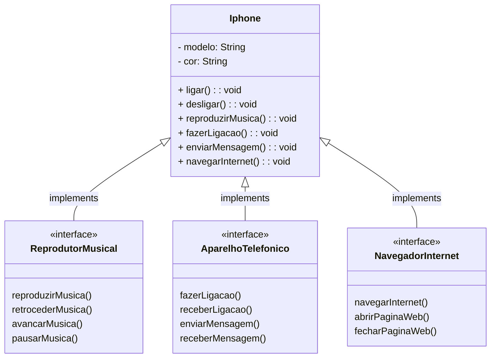

# deafio-dio-uml

```mermaid
classDiagram
class Iphone {
  - modelo: String
  - cor: String

  + ligar(): void
  + desligar(): void
  + reproduzirMusica(): void
  + fazerLigacao(): void
  + enviarMensagem(): void
  + navegarInternet(): void
}

class ReprodutorMusical

<<interface>> ReprodutorMusical
ReprodutorMusical : reproduzirMusica()
ReprodutorMusical : retrocederMusica()
ReprodutorMusical : avancarMusica()
ReprodutorMusical : pausarMusica()

class AparelhoTelefonico

<<interface>> AparelhoTelefonico
  AparelhoTelefonico : fazerLigacao()
  AparelhoTelefonico : receberLigacao()
  AparelhoTelefonico : enviarMensagem()
  AparelhoTelefonico : receberMensagem()

class NavegadorInternet

<<interface>> NavegadorInternet
  NavegadorInternet : navegarInternet()
  NavegadorInternet : abrirPaginaWeb()
  NavegadorInternet : fecharPaginaWeb()


Iphone <|-- ReprodutorMusical : implements
Iphone <|-- AparelhoTelefonico : implements
Iphone <|-- NavegadorInternet : implements

```
